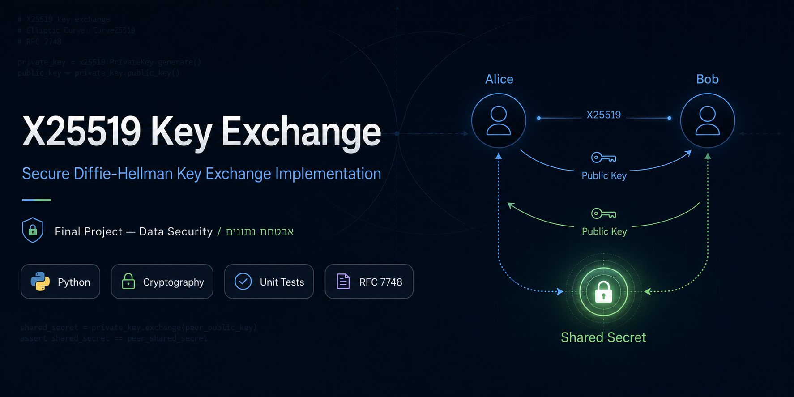

<p align="center">
  
</p>

# X25519 Key Exchange — Final Project

## Implementation and Analysis of X25519 Elliptic-Curve Diffie-Hellman Using the Montgomery Ladder

A documented educational implementation of **X25519 elliptic-curve Diffie-Hellman key exchange** in Python for the **Data Security / אבטחת נתונים** final project.

This project implements the core X25519 primitive manually, including scalar clamping, arithmetic modulo `p = 2^255 - 19`, Montgomery ladder scalar multiplication, public key generation, Alice/Bob shared-secret derivation, official test vector validation, negative tests, benchmarking, and a real multi-terminal encrypted chat demo.

The newest version also includes a small relay server and interactive clients so multiple users can connect from different terminals, choose who they want to communicate with, exchange X25519 public keys, derive a shared session key, and continue sending encrypted messages until one side disconnects.

---

## Quick Links

- [Project Goal](#project-goal)
- [What X25519 Does](#what-x25519-does)
- [Project Structure](#project-structure)
- [Setup](#setup)
- [Run the Simple Demo](#run-the-simple-demo)
- [Run the Multi-Terminal Secure Chat](#run-the-multi-terminal-secure-chat)
- [Secure Chat Commands](#secure-chat-commands)
- [Run the GUI Server](#run-the-gui-server)
- [Run the GUI Client](#run-the-gui-client)
- [Run the Tests](#run-the-tests)
- [Run the Benchmark](#run-the-benchmark)
- [Testing Strategy](#testing-strategy)
- [What Was Implemented Manually](#what-was-implemented-manually)
- [Security Notice](#security-notice)
- [Academic Context](#academic-context)

---

## Project Goal

The goal of this project is to understand and implement a real modern cryptographic key-exchange primitive.

X25519 solves the following problem:

> How can two parties agree on the same shared secret over an insecure communication channel without sending the secret itself?

In this project, Alice and Bob each generate a private/public key pair. They exchange public keys, and then both derive the same shared secret:

```text
Alice private key + Bob public key   -> shared secret
Bob private key + Alice public key   -> same shared secret
```

An attacker may observe the exchanged public keys, but should not be able to efficiently derive the shared secret.

---

## What X25519 Does

X25519 is a **key exchange** primitive.

It does **not** encrypt messages by itself. Instead, it produces a shared secret. In real protocols, that shared secret is usually passed into a key derivation function, and the derived key is then used with a symmetric cipher such as AES or ChaCha20.

This project follows that model in the terminal chat demo:

```text
X25519 shared secret
        ↓
HKDF-SHA256
        ↓
AES-GCM session key
        ↓
encrypted terminal chat messages
```

The X25519 operation itself is implemented manually in `src/x25519.py`. HKDF and AES-GCM are used only as supporting primitives outside the focus of the project.

---

## Project Structure

```text
x25519-key-exchange/
│
├── assets/
│   └── X25519-Banner.png
│
├── src/
│   ├── __init__.py
│   ├── x25519.py              # manual X25519 core
│   ├── key_exchange.py        # high-level X25519 party wrapper
│   ├── protocol.py            # JSON protocol messages and validation
│   ├── secure_message.py      # HKDF + AES-GCM encrypted message helpers
│   ├── session.py             # pairwise secure session state
│   └── network.py             # JSON-over-TCP socket helpers
│
├── tests/
│   ├── __init__.py
│   ├── test_x25519_vectors.py
│   ├── test_key_exchange.py
│   ├── test_negative_cases.py
│   ├── test_protocol.py
│   ├── test_secure_message.py
│   └── test_session.py
│
├── docs/
│   ├── communication_protocol.md
│   ├── final_report_outline.md
│   ├── interim_report_outline.md
│   └── references.md
│
├── server.py                  # multi-user relay server (unchanged)
├── client.py                  # terminal secure chat client (unchanged)
├── gui_server.py              # Tkinter GUI server with live traffic monitor
├── gui_client.py              # GUI-compatible client core (callbacks, no print)
├── gui_app.py                 # Tkinter GUI client application
├── benchmark.py
├── demo.py
├── requirements.txt
├── .gitignore
└── README.md
```

---

## Implementation Overview

### `src/x25519.py`

This file contains the cryptographic core of the project.

Main functions:

- `_validate_32_bytes(value, name)`
- `clamp_scalar(private_key)`
- `decode_u_coordinate(public_key)`
- `conditional_swap(swap, first, second)`
- `x25519(private_key, public_key)`
- `generate_public_key(private_key)`

The central function is:

```python
x25519(private_key, public_key) -> bytes
```

It is used for both public key generation and shared-secret derivation:

```python
public_key = x25519(private_key, BASE_POINT)
shared_secret = x25519(my_private_key, other_public_key)
```

### `src/key_exchange.py`

This file provides a higher-level Alice/Bob interface around the low-level primitive.

It includes:

- random private key generation
- public key generation
- shared-secret derivation
- a simple `X25519Party` class
- all-zero shared secret rejection at the high-level protocol layer

### `src/session.py`

Stores one secure pairwise session between two users.

Each session has:

- a fresh local X25519 private/public key pair
- the peer's public key
- the derived X25519 shared secret
- the derived AES-GCM session key
- a readable fingerprint for manual comparison

### `src/secure_message.py`

Turns the X25519 shared secret into a usable encrypted messaging key:

```text
shared secret -> HKDF-SHA256 -> AES-GCM key
```

AES-GCM gives confidentiality and message authentication. If a ciphertext is changed, decryption fails.

### `server.py`

The relay server tracks online users and forwards messages.

The server does **not** perform X25519 and does **not** decrypt messages.

### `client.py`

The client connects to the relay server, lets the user choose another online user, performs the X25519 public-key exchange, derives a session key, and sends encrypted messages until one side disconnects.

---

## Setup

Create a virtual environment:

```bash
python -m venv .venv
```

Activate it:

### macOS / Linux

```bash
source .venv/bin/activate
```

### Windows PowerShell

```powershell
.\.venv\Scripts\Activate.ps1
```

Install dependencies:

```bash
pip install -r requirements.txt
```

Dependencies:

- `pytest` for tests
- `cryptography` for HKDF-SHA256 and AES-GCM in the encrypted chat layer

---

## Run the Simple Demo

```bash
python demo.py
```

Example output:

```text
X25519 Alice/Bob Key Exchange Demo
----------------------------------
Alice public key: ...
Bob public key:   ...

Alice shared secret: ...
Bob shared secret:   ...

SUCCESS: Alice and Bob derived the same shared secret.
```

The public keys and shared secret change on each run because fresh random private keys are generated.

---

## Run the Multi-Terminal Secure Chat

Open a server terminal:

```bash
python server.py --host 127.0.0.1 --port 5000
```

Open an Alice terminal:

```bash
python client.py --name Alice --server 127.0.0.1 --port 5000
```

Open a Bob terminal:

```bash
python client.py --name Bob --server 127.0.0.1 --port 5000
```

Optional third user:

```bash
python client.py --name X --server 127.0.0.1 --port 5000
```

Example flow:

```text
Alice: /users
Alice: /connect Bob

Bob receives:
Incoming secure chat request from Alice.
Type /accept Alice or /reject Alice

Bob: /accept Alice
```

After the public-key exchange, both sides should see:

```text
Secure session established with Alice/Bob.
Session fingerprint: XX:XX:XX:XX:...
```

Then choose the active session and send messages:

```text
/use Bob
hello Bob
this message is encrypted
```

Bob can also have a separate secure session with `X` at the same time:

```text
/use X
hello X
```

Each pair has a separate X25519 shared secret and separate AES-GCM session key.

---

## Secure Chat Commands

```text
/help                 Show the help menu
/users                Show online users
/connect <name>       Request a secure chat with another user
/accept <name>        Accept a pending secure chat request
/reject <name>        Reject a pending secure chat request
/use <name>           Switch the active secure chat session
/sessions             Show active/pending secure sessions
/fingerprint <name>   Show the session fingerprint for manual comparison
/disconnect <name>    Close a secure session with one user
/quit                 Exit the client
```

Normal text is encrypted and sent to the currently active secure session.

A session continues until one side uses `/disconnect <name>`, exits with `/quit`, or loses connection to the server.

---


## Run the GUI Server

A graphical server is also available. It shows every message the server
relays in real time, making it ideal for a live demo or graded presentation.

```bash
python gui_server.py
```

Click **▶ Start Server** to begin listening. The terminal server (`server.py`)
and GUI server are functionally identical — all clients are compatible with both.

### What the GUI server displays

| Panel | Content |
|-------|---------|
| **Server Control** | Bind address, port, Start/Stop buttons, running status badge |
| **Live Statistics** | Total connections, active clients, public keys relayed, messages forwarded |
| **Connected Clients** | Live list of registered usernames |
| **Key Exchange Pairs** | Active pairs currently in a key exchange handshake |
| **What This Server Never Sees** | Educational reminder: no private keys, no shared secrets, no plaintext |
| **Message Traffic** | Color-coded log of every forwarded message — type, sender→receiver, payload description |
| **Server Event Log** | Timestamped connect / disconnect / error events |

### Message Traffic color coding

| Color | Message type | Meaning |
|-------|-------------|---------|
| Amber | `chat_request` | Alice asked Bob to start a key exchange |
| Green | `chat_accept` | Bob accepted the request |
| Red | `chat_reject` | Bob rejected the request |
| Blue | `public_key` | A 32-byte X25519 public key was relayed (server cannot use it) |
| Purple | `encrypted_message` | An AES-GCM ciphertext was relayed (server cannot decrypt it) |
| Dim | `session_disconnect` | One side closed the session |

### Architecture note

`gui_server.py` adds two subclasses without modifying `server.py`:

- **`ObservableChatServer`** — overrides `register_client` and `unregister_client`
  to fire callbacks, and adds `record_forwarded()` called on every relay event.
- **`ObservableRequestHandler`** — overrides `forward_to_peer` and `handle_register`
  to route events through the callbacks instead of printing to stdout.

`server.py` is completely untouched.

---
## Run the GUI Client

The GUI client provides a graphical interface on top of the same server and cryptographic logic.
It does not replace the terminal client — both can be used simultaneously.

### Dependencies

The GUI uses **Tkinter**, which is included with Python. No extra packages are needed beyond the existing `requirements.txt`.

### Quick Start

**Step 1 — Start the server** (same as the terminal version):

```bash
python server.py --host 127.0.0.1 --port 5000
```

**Step 2 — Open Alice's GUI window:**

```bash
python gui_app.py
```

In the Connection section, enter `Alice` as the username and click **Connect to Server**.

**Step 3 — Open Bob's GUI window** (in a separate terminal):

```bash
python gui_app.py
```

Enter `Bob` as the username and click **Connect to Server**.

Both clients will appear in each other's **Connected Clients** list automatically.

### Alice and Bob Key Exchange Demo

| Step | Alice does | Bob does |
|------|-----------|---------|
| 1 | Selects `Bob` in the Connected Clients list | — |
| 2 | Clicks **⇄ Start Key Exchange** | — |
| 3 | — | Bob's Event Log shows the incoming request. Bob selects Alice, clicks **✓ Accept Request** |
| 4 | Alice's Key Exchange Status shows "Handshake in progress" | Bob sends his public key automatically |
| 5 | Alice's GUI shows "Shared secret derived successfully" + fingerprint | Bob's GUI shows the same fingerprint |
| 6 | Chat is unlocked — Alice types a message and clicks Send | Bob sees Alice's decrypted message |

### How to Verify Both Sides Derive the Same Shared Secret

After the key exchange completes, both Alice and Bob see a **Fingerprint** value in the Key Exchange Status section.
This fingerprint is a short hash of the derived session key.

**If Alice and Bob's fingerprints match → the shared secret is identical on both sides.**

The fingerprint is intentionally short and readable so it can be compared verbally or visually during a demo.
It is not a secret itself — it is a verification tool.

### GUI Sections Explained

| Section | What it shows |
|---------|--------------|
| **Connection** | Username, server address, Connect/Disconnect, connection status |
| **My Key Information** | Your local X25519 public key for the selected session |
| **Connected Clients** | Live list of other online users; double-click or click Start Key Exchange |
| **Key Exchange Status** | Peer's public key, shared secret confirmation, fingerprint, session state |
| **Secure Chat** | Message history + send box (locked until key exchange completes) |
| **Event Log** | Timestamped stream of all protocol events |

### Architecture Note

The GUI is implemented in two files:

- **`gui_client.py`** — networking/crypto core, refactored from `client.py` to use callbacks instead of `print()`. Imports the same `src/` modules unchanged.
- **`gui_app.py`** — Tkinter GUI that registers the callbacks and updates the interface.

The relay `server.py` is completely unchanged. Terminal clients and GUI clients can connect to the same server simultaneously.

---
## Run the Tests

```bash
pytest
```

Current test suite:

```text
26 passed
```

The tests cover:

- official X25519 test vectors
- Alice/Bob round-trip key exchange
- wrong public key behavior
- invalid private key length
- invalid public key length
- invalid private key type
- invalid public key type
- all-zero shared-secret rejection for invalid or unsafe public inputs
- protocol username and hex validation
- HKDF session-key derivation
- AES-GCM encryption and decryption
- tampered ciphertext rejection
- wrong-key rejection
- empty and Unicode messages
- pairwise secure session establishment

---

## Run the Benchmark

```bash
python benchmark.py
```

The benchmark measures:

- party creation / public key generation time
- shared-secret derivation time
- private key size
- public key size
- shared secret size

These numbers are from an educational pure-Python implementation and should not be compared directly to optimized production cryptographic libraries.

---

## Testing Strategy

Cryptographic code must be checked carefully because an implementation that only works in one demo is not enough.

This project uses several layers of testing:

### 1. Official test vectors

The low-level `x25519()` function is tested against known X25519 input/output pairs.

### 2. Round-trip key exchange tests

Alice and Bob independently derive the same shared secret.

### 3. Negative tests

The project checks that invalid inputs, wrong keys, all-zero shared secrets, and tampered encrypted messages are rejected.

### 4. Secure messaging tests

The encrypted messaging layer checks that valid messages decrypt correctly and modified messages fail authentication.

### 5. Session tests

The session tests prove that two independent session objects, one on Alice's side and one on Bob's side, derive the same session key from exchanged public keys.

---

## What Was Implemented Manually

The core X25519 operation was implemented directly in Python.

Implemented manually:

- scalar clamping
- public u-coordinate decoding
- conditional swap
- Montgomery ladder
- modular arithmetic over `p = 2^255 - 19`
- conversion from projective coordinates back to affine form
- public key generation
- shared-secret derivation
- high-level all-zero shared secret rejection

No cryptographic library is used to perform the X25519 operation.

The project uses the `cryptography` library only after X25519, for:

- HKDF-SHA256 session-key derivation
- AES-GCM authenticated encryption for chat messages

---

## Security Notice

This project is for educational and academic purposes only.

It should **not** be used in production cryptographic systems.

Reasons:

- Python integer operations are not guaranteed to be constant-time.
- The implementation prioritizes readability and learning.
- The terminal protocol does not provide real identity authentication.
- Without authentication, a man-in-the-middle could replace public keys.
- The printed fingerprint is only a manual demonstration aid; real protocols use certificates, signatures, pre-shared authentication keys, or another authentication mechanism.

Important distinction:

- X25519 creates the shared secret.
- HKDF turns that shared secret into a symmetric session key.
- AES-GCM encrypts and authenticates messages.
- Authentication of the peer is still a separate protocol problem.

---

## Academic Context

This project connects to several topics from the Data Security course:

- modular arithmetic
- public/private key cryptography
- Diffie-Hellman key exchange
- finite fields
- modular inverse
- comparison with RSA-style public-key systems
- use of shared secrets with symmetric encryption
- secure protocol design limitations such as man-in-the-middle attacks

X25519 extends these foundations into a modern elliptic-curve key exchange primitive used in real-world secure communication protocols.

---

## References

Main sources used for the project are collected in:

```text
docs/references.md
```

Key references include:

- Daniel J. Bernstein, *Curve25519: New Diffie-Hellman Speed Records*
- Bernstein and Lange, *Montgomery Curves and the Montgomery Ladder*
- Costello and Smith, *Montgomery Curves and Their Arithmetic*
- RFC 7748, *Elliptic Curves for Security*
- RFC 8446, *The Transport Layer Security Protocol Version 1.3*
