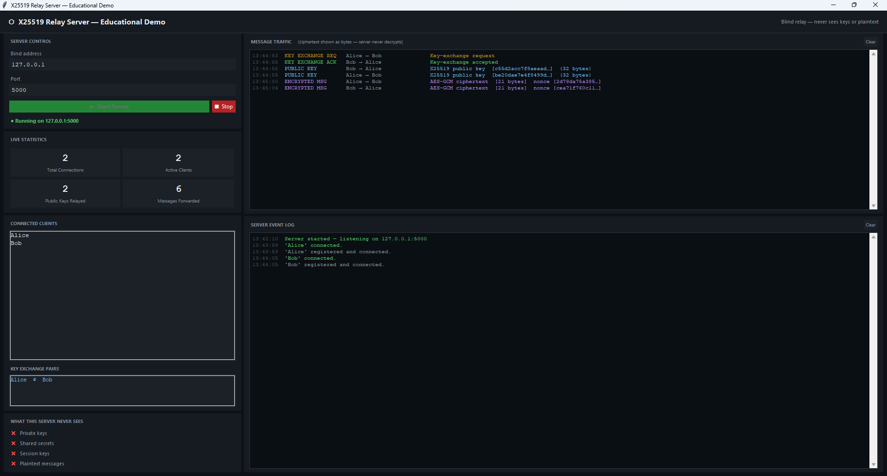
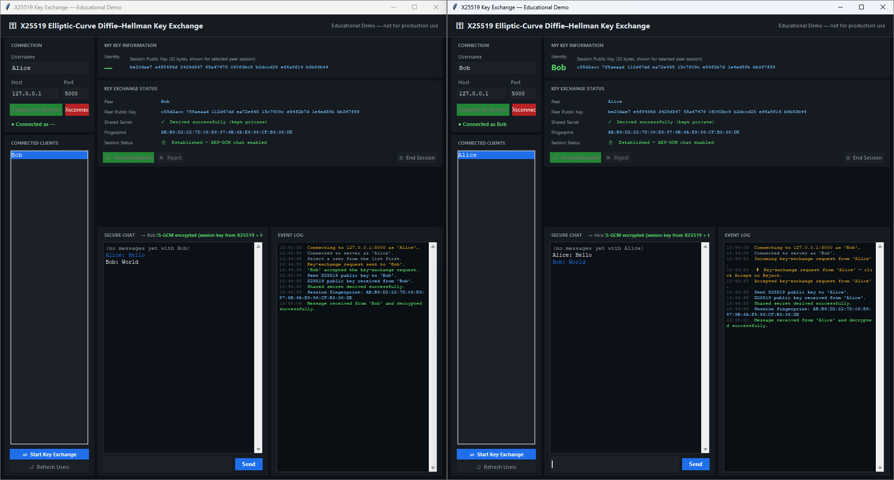

<p align="center">
  
</p>

# X25519 Key Exchange — Final Project

## Implementation and Analysis of X25519 Elliptic-Curve Diffie-Hellman Using the Montgomery Ladder

A documented educational implementation of **X25519 elliptic-curve Diffie-Hellman key exchange** in Python for the **Data Security / אבטחת נתונים** final project.

This project implements the core X25519 primitive manually, including scalar clamping, arithmetic modulo `p = 2^255 - 19`, Montgomery ladder scalar multiplication, public key generation, Alice/Bob shared-secret derivation, official test vector validation, negative tests, benchmarking, and a working encrypted chat demonstration.

The main demo experience is a **full GUI-based secure chat system**:

- a graphical relay server that shows connections, public-key relays, encrypted traffic, and live statistics;
- graphical Alice/Bob clients that perform X25519 key exchange, compare fingerprints, derive the same session key, and exchange AES-GCM encrypted messages;
- a blind relay design where the server forwards public keys and ciphertexts but never sees private keys, shared secrets, session keys, or plaintext messages.

The terminal server/client are also included for a simpler command-line demonstration.

---

## Quick Links

- [Project Goal](#project-goal)
- [What X25519 Does](#what-x25519-does)
- [GUI Demo Preview](#gui-demo-preview)
- [Project Structure](#project-structure)
- [Implementation Overview](#implementation-overview)
- [Setup](#setup)
- [Recommended Demo: Full GUI Experience](#recommended-demo-full-gui-experience)
- [Run the GUI Server](#run-the-gui-server)
- [Run the GUI Client](#run-the-gui-client)
- [Run the Terminal Secure Chat](#run-the-terminal-secure-chat)
- [Secure Chat Commands](#secure-chat-commands)
- [Run the Simple Demo](#run-the-simple-demo)
- [Run the Tests](#run-the-tests)
- [Run the Benchmark](#run-the-benchmark)
- [Testing Strategy](#testing-strategy)
- [What Was Implemented Manually](#what-was-implemented-manually)
- [Security Notice](#security-notice)
- [Academic Context](#academic-context)
- [References](#references)

---

## Project Goal

The goal of this project is to understand and implement a real modern cryptographic key-exchange primitive.

X25519 solves the following problem:

> How can two parties agree on the same shared secret over an insecure communication channel without sending the secret itself?

In this project, Alice and Bob each generate a private/public key pair. They exchange public keys, and then both derive the same shared secret:

```text
Alice private key + Bob public key   -> shared secret
Bob private key + Alice public key   -> same shared secret
```

An attacker may observe the exchanged public keys, but should not be able to efficiently derive the shared secret.

---

## What X25519 Does

X25519 is a **key exchange** primitive.

It does **not** encrypt messages by itself. Instead, it produces a shared secret. In real protocols, that shared secret is usually passed into a key derivation function, and the derived key is then used with a symmetric cipher such as AES or ChaCha20.

This project follows that model in both the GUI demo and the terminal chat demo:

```text
X25519 shared secret
        ↓
HKDF-SHA256
        ↓
AES-GCM session key
        ↓
encrypted chat messages
```

The X25519 operation itself is implemented manually in `src/x25519.py`. HKDF-SHA256 and AES-GCM are used only as supporting primitives outside the focus of the project.

---

## GUI Demo Preview

### Relay server view

The GUI relay server is intentionally designed as a **blind relay**. It shows that users are connected and that public keys / ciphertext messages are being forwarded, but it never displays private keys, shared secrets, AES-GCM keys, or plaintext messages.

<p align="center">
  
</p>

### Alice and Bob client view

Each GUI client shows the local public key, the peer public key, the key-exchange status, the derived-session fingerprint, and the encrypted chat area. Matching fingerprints on both sides demonstrate that Alice and Bob derived the same session key.

<p align="center">
  
</p>

---

## Project Structure

```text
x25519-key-exchange/
│
├── assets/
│   ├── X25519-Banner.png
│   ├── gui-server-demo.png
│   └── gui-client-demo.png
│
├── src/
│   ├── x25519.py              # manual X25519 core
│   ├── key_exchange.py        # high-level X25519 party wrapper
│   ├── protocol.py            # JSON protocol messages and validation
│   ├── secure_message.py      # HKDF + AES-GCM encrypted message helpers
│   ├── session.py             # pairwise secure session state
│   └── network.py             # JSON-over-TCP socket helpers
│
├── tests/
│   ├── test_x25519_vectors.py
│   ├── test_key_exchange.py
│   ├── test_negative_cases.py
│   ├── test_protocol.py
│   ├── test_secure_message.py
│   └── test_session.py
│
├── docs/
│   ├── communication_protocol.md
│   ├── final_report_outline.md
│   ├── interim_report_outline.md
│   └── references.md
│
├── server.py                  # multi-user terminal relay server
├── client.py                  # terminal secure chat client
├── gui_server.py              # Tkinter GUI server with live traffic monitor
├── gui_client.py              # GUI-compatible client core using callbacks
├── gui_app.py                 # Tkinter GUI client application
├── benchmark.py               # performance measurements
├── demo.py                    # simple Alice/Bob X25519 demo
├── requirements.txt
├── .gitignore
└── README.md
```

---

## Implementation Overview

### `src/x25519.py`

This file contains the cryptographic core of the project.

Main functions:

- `_validate_32_bytes(value, name)`
- `clamp_scalar(private_key)`
- `decode_u_coordinate(public_key)`
- `conditional_swap(swap, first, second)`
- `x25519(private_key, public_key)`
- `generate_public_key(private_key)`

The central function is:

```python
x25519(private_key, public_key) -> bytes
```

It is used for both public key generation and shared-secret derivation:

```python
public_key = x25519(private_key, BASE_POINT)
shared_secret = x25519(my_private_key, other_public_key)
```

### `src/key_exchange.py`

This file provides a higher-level Alice/Bob interface around the low-level primitive.

It includes:

- random private key generation;
- public key generation;
- shared-secret derivation;
- a simple `X25519Party` class;
- all-zero shared-secret rejection at the high-level protocol layer.

### `src/session.py`

Stores one secure pairwise session between two users.

Each session has:

- a fresh local X25519 private/public key pair;
- the peer's public key;
- the derived X25519 shared secret;
- the derived AES-GCM session key;
- a readable fingerprint for manual comparison.

### `src/secure_message.py`

Turns the X25519 shared secret into a usable encrypted messaging key:

```text
shared secret -> HKDF-SHA256 -> AES-GCM key
```

AES-GCM gives confidentiality and message authentication. If a ciphertext is changed, decryption fails.

### `server.py`

The terminal relay server tracks online users and forwards messages.

The server does **not** perform X25519 and does **not** decrypt messages.

### `client.py`

The terminal client connects to the relay server, lets the user choose another online user, performs the X25519 public-key exchange, derives a session key, and sends encrypted messages until one side disconnects.

### `gui_server.py`

The graphical relay server shows the educational protocol flow visually:

- connected clients;
- live connection statistics;
- public-key relay events;
- encrypted-message relay events;
- server event log;
- reminder that the server never sees private keys, shared secrets, session keys, or plaintext.

### `gui_client.py` and `gui_app.py`

The GUI client is split into two layers:

- `gui_client.py` contains the networking and cryptographic client logic using callbacks instead of direct terminal printing;
- `gui_app.py` contains the Tkinter interface and updates the visual components.

This keeps the cryptographic/session logic separate from the graphical interface.

---

## Setup

Create a virtual environment:

```bash
python -m venv .venv
```

Activate it:

### macOS / Linux

```bash
source .venv/bin/activate
```

### Windows PowerShell

```powershell
.\.venv\Scripts\Activate.ps1
```

Install dependencies:

```bash
pip install -r requirements.txt
```

Dependencies:

- `pytest` for tests;
- `cryptography` for HKDF-SHA256 and AES-GCM in the encrypted chat layer;
- `tkinter` for the GUI, usually included with Python.

On some Linux distributions, Tkinter may require installing `python3-tk` through the system package manager.

---

## Recommended Demo: Full GUI Experience

The recommended way to present the project is with one GUI server window and two GUI client windows.

### Step 1 — Start the GUI server

```bash
python gui_server.py
```

Click **▶ Start Server**.

### Step 2 — Start Alice

Open a second terminal:

```bash
python gui_app.py
```

Enter:

```text
Username: Alice
Host: 127.0.0.1
Port: 5000
```

Click **Connect to Server**.

### Step 3 — Start Bob

Open a third terminal:

```bash
python gui_app.py
```

Enter:

```text
Username: Bob
Host: 127.0.0.1
Port: 5000
```

Click **Connect to Server**.

### Step 4 — Run the key exchange

| Step | Alice does | Bob does |
|------|------------|----------|
| 1 | Selects `Bob` in the Connected Clients list | Waits for request |
| 2 | Clicks **⇄ Start Key Exchange** | Receives an incoming request |
| 3 | Waits for response | Selects `Alice` and clicks **✓ Accept Request** |
| 4 | Receives Bob's public key | Sends Bob's public key automatically |
| 5 | Derives the shared secret and session key | Derives the same shared secret and session key |
| 6 | Compares fingerprint | Compares matching fingerprint |
| 7 | Sends encrypted message | Receives and decrypts message |

After the handshake completes, both clients should show:

```text
Derived successfully
Session Status: Established — AES-GCM chat enabled
```

The server window should show that public keys and encrypted messages were relayed, while still not seeing any plaintext.

---

## Run the GUI Server

A graphical server is available for the main demo. It shows every public-key and encrypted-message relay event in real time, making it ideal for a live demo or graded presentation.

```bash
python gui_server.py
```

Click **▶ Start Server** to begin listening. The terminal server (`server.py`) and GUI server are compatible with the same clients.

### What the GUI server displays

| Panel | Content |
|-------|---------|
| **Server Control** | Bind address, port, Start/Stop buttons, running status badge |
| **Live Statistics** | Total connections, active clients, public keys relayed, messages forwarded |
| **Connected Clients** | Live list of registered usernames |
| **Key Exchange Pairs** | Active pairs currently in a key-exchange handshake |
| **What This Server Never Sees** | Educational reminder: no private keys, no shared secrets, no session keys, no plaintext |
| **Message Traffic** | Color-coded log of every forwarded message: type, sender → receiver, payload description |
| **Server Event Log** | Timestamped connect / disconnect / error events |

### Message Traffic color coding

| Color | Message type | Meaning |
|-------|--------------|---------|
| Amber | `chat_request` | Alice asked Bob to start a key exchange |
| Green | `chat_accept` | Bob accepted the request |
| Red | `chat_reject` | Bob rejected the request |
| Blue | `public_key` | A 32-byte X25519 public key was relayed; the server cannot use it |
| Purple | `encrypted_message` | An AES-GCM ciphertext was relayed; the server cannot decrypt it |
| Dim | `session_disconnect` | One side closed the session |

### Architecture note

`gui_server.py` adds two subclasses without modifying `server.py`:

- **`ObservableChatServer`** — overrides `register_client` and `unregister_client` to fire callbacks, and adds `record_forwarded()` called on every relay event.
- **`ObservableRequestHandler`** — overrides `forward_to_peer` and `handle_register` to route events through the callbacks instead of printing to stdout.

---

## Run the GUI Client

The GUI client provides a graphical interface on top of the same server and cryptographic logic. It does not replace the terminal client; both can be used simultaneously.

```bash
python gui_app.py
```

### GUI Sections Explained

| Section | What it shows |
|---------|---------------|
| **Connection** | Username, server address, Connect/Disconnect, connection status |
| **My Key Information** | Local X25519 public key for the selected session |
| **Connected Clients** | Live list of other online users; select a user and start key exchange |
| **Key Exchange Status** | Peer public key, shared-secret confirmation, fingerprint, session state |
| **Secure Chat** | Message history and send box, locked until key exchange completes |
| **Event Log** | Timestamped stream of protocol events |

### How to Verify Both Sides Derive the Same Shared Secret

After the key exchange completes, both Alice and Bob see a **Fingerprint** value in the Key Exchange Status section.

**If Alice and Bob's fingerprints match, the shared secret and derived session key are identical on both sides.**

The fingerprint is intentionally short and readable so it can be compared verbally or visually during a demo. It is not a secret itself; it is a verification tool.

---

## Run the Terminal Secure Chat

The same protocol can also be demonstrated from the terminal.

Open a server terminal:

```bash
python server.py --host 127.0.0.1 --port 5000
```

Open an Alice terminal:

```bash
python client.py --name Alice --server 127.0.0.1 --port 5000
```

Open a Bob terminal:

```bash
python client.py --name Bob --server 127.0.0.1 --port 5000
```

Optional third user:

```bash
python client.py --name X --server 127.0.0.1 --port 5000
```

Example flow:

```text
Alice: /users
Alice: /connect Bob

Bob receives:
Incoming secure chat request from Alice.
Type /accept Alice or /reject Alice

Bob: /accept Alice
```

After the public-key exchange, both sides should see:

```text
Secure session established with Alice/Bob.
Session fingerprint: XX:XX:XX:XX:...
```

Then choose the active session and send messages:

```text
/use Bob
hello Bob
this message is encrypted
```

Each pair has a separate X25519 shared secret and separate AES-GCM session key.

---

## Secure Chat Commands

```text
/help                 Show the help menu
/users                Show online users
/connect <name>       Request a secure chat with another user
/accept <name>        Accept a pending secure chat request
/reject <name>        Reject a pending secure chat request
/use <name>           Switch the active secure chat session
/sessions             Show active/pending secure sessions
/fingerprint <name>   Show the session fingerprint for manual comparison
/disconnect <name>    Close a secure session with one user
/quit                 Exit the client
```

Normal text is encrypted and sent to the currently active secure session.

A session continues until one side uses `/disconnect <name>`, exits with `/quit`, or loses connection to the server.

---

## Run the Simple Demo

```bash
python demo.py
```

Example output:

```text
X25519 Alice/Bob Key Exchange Demo
----------------------------------
Alice public key: ...
Bob public key:   ...

Alice shared secret: ...
Bob shared secret:   ...

SUCCESS: Alice and Bob derived the same shared secret.
```

The public keys and shared secret change on each run because fresh random private keys are generated.

---

## Run the Tests

```bash
python -m pytest -q
```

Current test suite:

```text
26 passed
```

The tests cover:

- official X25519 test vectors;
- Alice/Bob round-trip key exchange;
- wrong public key behavior;
- invalid private key length;
- invalid public key length;
- invalid private key type;
- invalid public key type;
- all-zero shared-secret rejection for invalid or unsafe public inputs;
- protocol username and hex validation;
- HKDF session-key derivation;
- AES-GCM encryption and decryption;
- tampered ciphertext rejection;
- wrong-key rejection;
- empty and Unicode messages;
- pairwise secure session establishment.

---

## Clean-Machine Verification

From a fresh clone or extracted archive:

```bash
python -m venv .venv
source .venv/bin/activate      # macOS/Linux
pip install -r requirements.txt
python -m pytest -q
python demo.py
python benchmark.py
```

On Windows PowerShell, activate the environment with:

```powershell
.\.venv\Scripts\Activate.ps1
```

For the recommended GUI demonstration, run:

```bash
python gui_server.py
python gui_app.py
python gui_app.py
```

Use different usernames such as `Alice` and `Bob` in the two client windows.

---

## Run the Benchmark

```bash
python benchmark.py
```

The benchmark measures:

- party creation / public key generation time;
- shared-secret derivation time;
- private key size;
- public key size;
- shared secret size.

These numbers are from an educational pure-Python implementation and should not be compared directly to optimized production cryptographic libraries.

---

## Testing Strategy

Cryptographic code must be checked carefully because an implementation that only works in one demo is not enough.

This project uses several layers of testing:

### 1. Official test vectors

The low-level `x25519()` function is tested against known X25519 input/output pairs.

### 2. Round-trip key exchange tests

Alice and Bob independently derive the same shared secret.

### 3. Negative tests

The project checks that invalid inputs, wrong keys, all-zero shared secrets, and tampered encrypted messages are rejected.

### 4. Secure messaging tests

The encrypted messaging layer checks that valid messages decrypt correctly and modified messages fail authentication.

### 5. Session tests

The session tests prove that two independent session objects, one on Alice's side and one on Bob's side, derive the same session key from exchanged public keys.

---

## What Was Implemented Manually

The core X25519 operation was implemented directly in Python.

Implemented manually:

- scalar clamping;
- public u-coordinate decoding;
- conditional swap;
- Montgomery ladder;
- modular arithmetic over `p = 2^255 - 19`;
- conversion from projective coordinates back to affine form;
- public key generation;
- shared-secret derivation;
- high-level all-zero shared-secret rejection.

No cryptographic library is used to perform the X25519 operation.

The project uses the `cryptography` library only after X25519, for:

- HKDF-SHA256 session-key derivation;
- AES-GCM authenticated encryption for chat messages.

---

## Security Notice

This project is for educational and academic purposes only.

It should **not** be used in production cryptographic systems.

Reasons:

- Python integer operations are not guaranteed to be constant-time.
- The implementation prioritizes readability and learning.
- The terminal/GUI chat protocol does not provide real identity authentication.
- Without authentication, a man-in-the-middle could replace public keys.
- The displayed fingerprint is only a manual demonstration aid; real protocols use certificates, signatures, pre-shared authentication keys, or another authentication mechanism.

Important distinction:

- X25519 creates the shared secret.
- HKDF turns that shared secret into a symmetric session key.
- AES-GCM encrypts and authenticates messages.
- Authentication of the peer is still a separate protocol problem.

---

## Academic Context

This project connects to several topics from the Data Security course:

- modular arithmetic;
- public/private key cryptography;
- Diffie-Hellman key exchange;
- finite fields;
- modular inverse;
- comparison with RSA-style public-key systems;
- use of shared secrets with symmetric encryption;
- secure protocol design limitations such as man-in-the-middle attacks.

X25519 extends these foundations into a modern elliptic-curve key exchange primitive used in real-world secure communication protocols.

---

## References

Main sources used for the project are collected in:

```text
docs/references.md
```

Key references include:

- Daniel J. Bernstein, *Curve25519: New Diffie-Hellman Speed Records*
- Bernstein and Lange, *Montgomery Curves and the Montgomery Ladder*
- Costello and Smith, *Montgomery Curves and Their Arithmetic*
- RFC 7748, *Elliptic Curves for Security*
- RFC 8446, *The Transport Layer Security Protocol Version 1.3*
